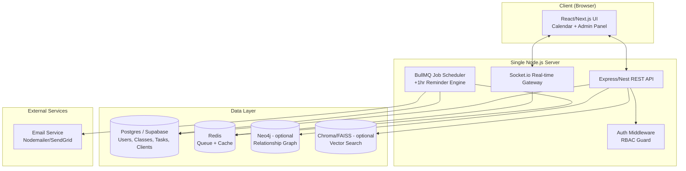
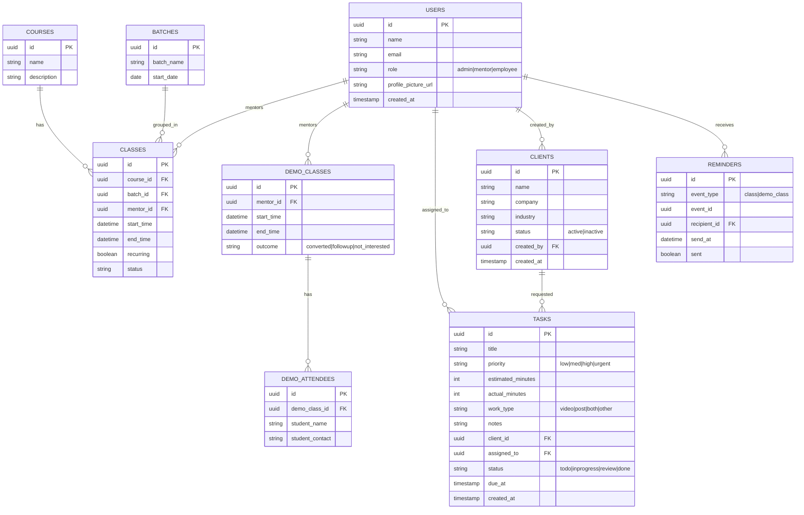
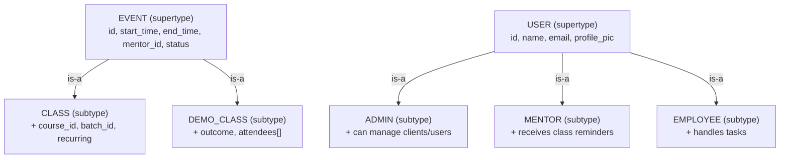
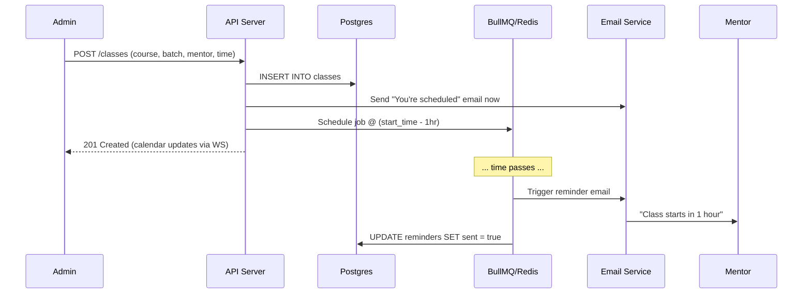
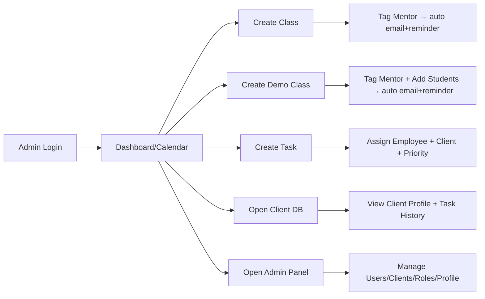
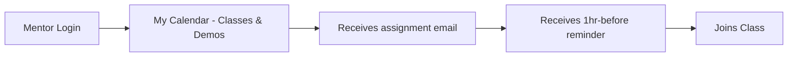
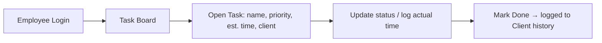
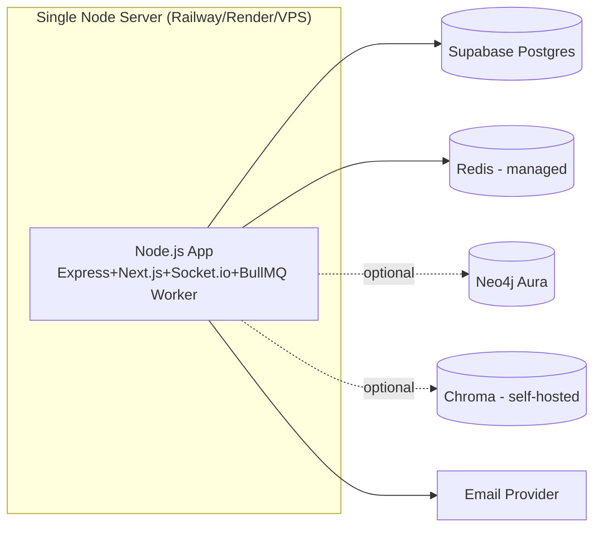

# architecture.md — System & Data Architecture

## 1. High-Level System Architecture (2D Component Diagram)



**Notes**
- Everything runs from **one Node.js process/repo** (monolith) — Express serves both the API and the built frontend (or Next.js API routes), satisfying the "one server" requirement.
- BullMQ + Redis handles delayed jobs: when a Class/Demo is created, a job is scheduled for `startTime - 1hr` to send the reminder email.
- Neo4j and the Vector DB are **optional modules**, loaded only if enabled — core app works fully on Postgres alone.

---

## 2. ER Diagram (Entity-Relationship)



---

## 3. EER Diagram (Extended ER — Generalization / Specialization)



**Rationale**: `CLASS` and `DEMO_CLASS` share the same core scheduling attributes (start/end/mentor/reminder logic) — modeled as an **EVENT supertype** in the domain layer (a shared `BaseEvent` interface in code, per SOLID §5) even though physically they may be two tables or one polymorphic `events` table with a `type` discriminator column. Same pattern applies to `USER` roles.

---

## 4. Sequence Diagram — "1D" Timeline: Class Creation → Reminder → Notification



---

## 5. User Flow Diagrams

### 5.1 Admin Flow


### 5.2 Mentor Flow


### 5.3 Employee Flow


---

## 6. Backend Architecture — SOLID / System Design

### 6.1 Layered Structure
```
/src
  /modules
    /calendar
      calendar.controller.ts
      calendar.service.ts
      calendar.repository.ts
      calendar.interfaces.ts
    /classes
    /demo-classes
    /tasks
    /clients
    /admin
    /reminders
      reminder.scheduler.ts   // BullMQ producer
      reminder.worker.ts      // BullMQ consumer
      reminder.strategy.ts    // interface: IReminderChannel (Email, future SMS)
  /core
    /auth        (JWT, RBAC guards)
    /events      (EventEmitter for domain events e.g. ClassCreated)
    /database    (Postgres client, Neo4j client, Vector client — behind interfaces)
  /shared
    /interfaces  (IRepository<T>, INotifiable, IEvent)
    /dto
```

### 6.2 SOLID Mapping
- **S**ingle Responsibility: Controllers only handle HTTP; Services hold business logic; Repositories only touch the DB.
- **O**pen/Closed: `IReminderChannel` interface — adding WhatsApp/SMS reminders later means adding a new class, not editing existing code.
- **L**iskov Substitution: `Class` and `DemoClass` both implement `IEvent` (start_time, end_time, mentor) and can be scheduled by the same `ReminderScheduler` interchangeably.
- **I**nterface Segregation: Separate `IEmailNotifiable`, `ITaskTrackable`, `IClientLinked` interfaces instead of one giant interface.
- **D**ependency Inversion: Services depend on `IRepository<T>` abstractions, not directly on Postgres/Supabase SDK — enables swapping DB or adding Neo4j/Vector layers without touching business logic.

### 6.3 Data Flow for Reminders (detailed)
1. Domain event `EventCreated` (Class or Demo) emitted after DB insert.
2. `ReminderScheduler` listens → calculates `sendAt = startTime - 1hr` → pushes delayed job to BullMQ.
3. `ReminderWorker` (cron-like, runs continuously) picks up due jobs → calls `IReminderChannel.send()` → currently `EmailChannel`.
4. Job result logged in `reminders` table (`sent = true/false`, retry on failure).

---

## 7. Deployment Architecture

